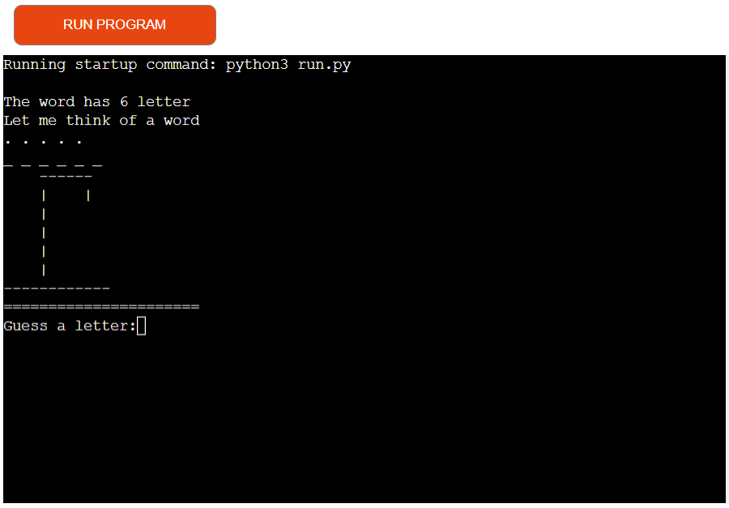
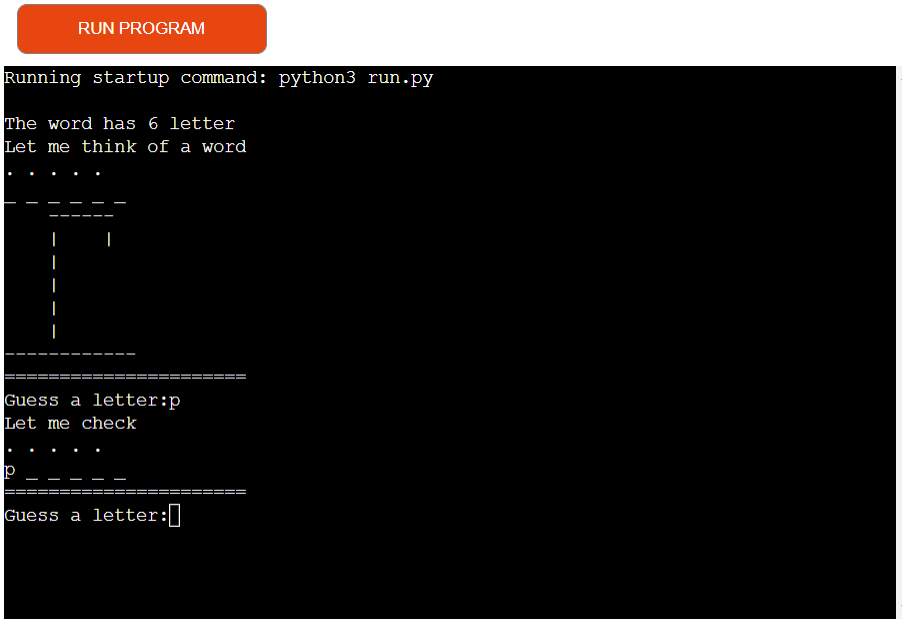
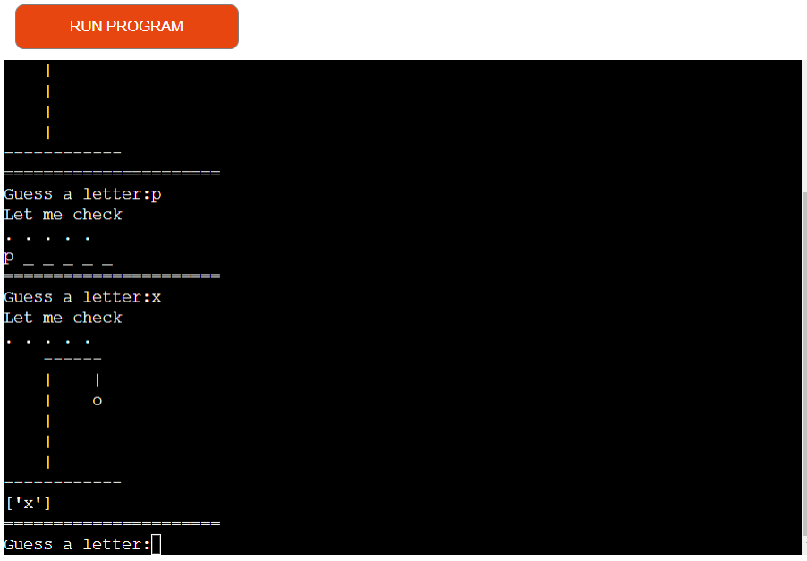
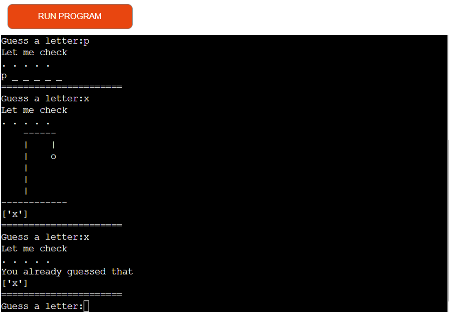
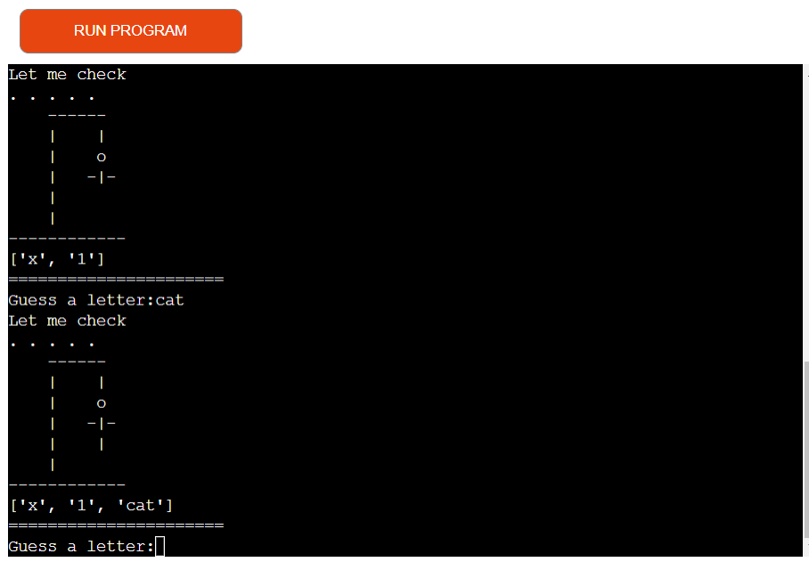
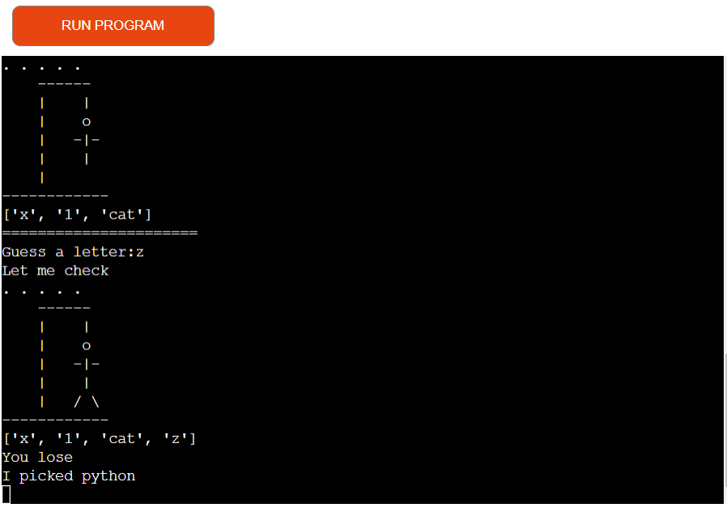
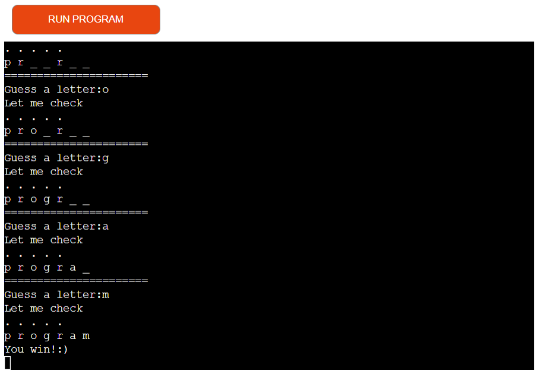

# Hangman 
Hangman is a Python terminal game, a player's objective is to identify a hidden words. In each round, the player guesses a letter of the alphabet, if it is present in the word all instances are revealed, otherwise one of the hangman's body parts is drawn in on the gibbet. The game ends in a win if the word entirly revealed by correct guesses, and ends in loss if the hangman's body is completely revealed in stead. To assist the player, a visible record of all guessed letters is typically maintained. 
The network receives as input a representation of the word (total number of characters, the identify of any revealed) as well as a list of which letters have been guessed so far. 

# How to play 
 - In this version, the computer is hiding two words which will be random word generation. The computer will let the player know how many letters are in the word. The message will appear on the screen "The word has 6 or 7 letters". The player enters any letter from the alphabet, if it is present in the word all instances are revealed. 
 - If a player will enter a number, that will be a wrong guess, one of the hangman's body parts is drawn in on the gibbet. 
 - If a player will enter the same wrong letter on the screen will appear message "You already guessed that" so player can not enter twice the same letter. 
 - If a player will enter a word, that will be a wrong guess, one of the hangman's body parts is drawn in on the gibbet. 
 - If a player guessed all letters in the hiding word, he win.  
 - If a player didn't guess all letters in the hiding word he lose and all of the hangman's body parts are drawn in on the gibbet.

# Features

## Existing features
 * Random word generation
  - The word is randomly placed on the board. 
  - The player can see how many letters are hiding in the word. 

  - If a player's guess is correct, that letter will apear on the board. 

  - If a player's guess is wrong, that wrong letter will apear in a wrong list on the board and one of the hangman's body parts is drawn in on the gibbet will apear on the board.

  - If a player will enter the same wrong letter will appear the message "You already guessed that".
  - The player can not enter the same guess twice. 

  - if a player will enter the number, that will be as a wrong guess will apear in a wrong list on the board and one of the hangman's body parts is drawn in on the gibbet will apear on the board.

  - if a player will enter the word instead of letter, that will be as a wrong guess will apear in a wrong list on the board and one of the hangman's body parts is drawn in on the gibbet will apear on the board.

  - If a player will enter 4 wrong letters, on the board will apear the message "You lose" and computer will show waht word he picked. 

  - If a player will guess all letters in the word, on the board will apear the message"You win :)".

# Future features
 * Add more words to random words generation.
 * Increase the number for the wrong answers.

# Testing
I have manually tested this project by doing the following: 
 * Passed the code through a PEP8 linter and confirmed there are no problems
 * Tested in my local terminal and the Heroku terminal

# Bugs

### Solved bugs

 * When I wrote my project I was getting error in len wrong answers as I gived 4 instead of 3. 

# Remaining Bugs

* No bugs remaining

# Validator Testing

* PEP8
  - No errors were returned from PEP8online.com

# Deployment 
* Steps for deployment
  - Fork or clone this repository
  - Create a new Heroku app
  - Set the buildbacks to Python and NodeJS in that order
  - Set the Config Var key: PORT and value: 8000 as instructed
  - Link the Heroku app to the repository
  - Click on Deploy

# Credits
* Tech with Mike adopted code from his youtube channel
* Love sandvich project from Code Institute
* Readme file Ultimate Batleship example from Code Institute